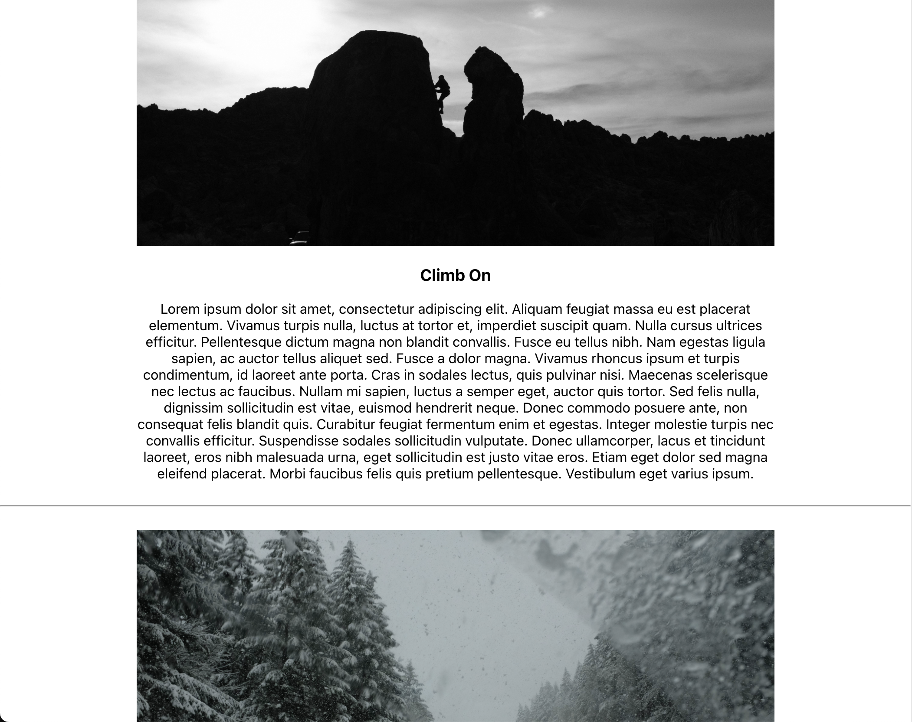

# Blogist

Blogist is a blogging template for artists of all sorts to display their work. An user will be able to log in, create posts, comment amnd reply to posts, and send contact messages to the blog creator.

## Technologies

- Django Rest Framework for backend API
- React frontend
- Javascript
- Python
- JWT Authentication
- Heroku Deployement

## User Stories

As the admin user I can:

- Create an admin account.
- Access the Admin page.
- Check messages
- Create Posts
- Edit Posts
- Delete Posts

As a user I can:

- Create a user account
- Read posts
- Comment on posts
- Reply to comments
- Send a message to the site creator

## List of Backend URLs

Route | View | Description
`posts-list/` | `PostsView` | Handles GET request for collection of posts and POST request to add new post
`posts-list/<int:pk>/` | `PostDetailView` | Handles GET, PUT, & DELETE request for single post
`get-admin/` | `BlogistView` | Handles Get request for admin user info
`posts-list/<int:pk>/comments/` | `CommentsView` | Handles Get request for collection of comments
`replies-list/<int:pk>/` | `RepliesView` | Handles Get request for collection of replies

## Screenshots

## Future Goals

- Get the user auth working
- Give basic users the ability to send messages the admin user
- Give admin user the ability to add custom styling to site
- Give signed up user the ability to add comments/replies from the frontend

## Challenges / Hurdles

- I'm still getting the hang of Django
- I haven't yet figured out how to get the user auth working
